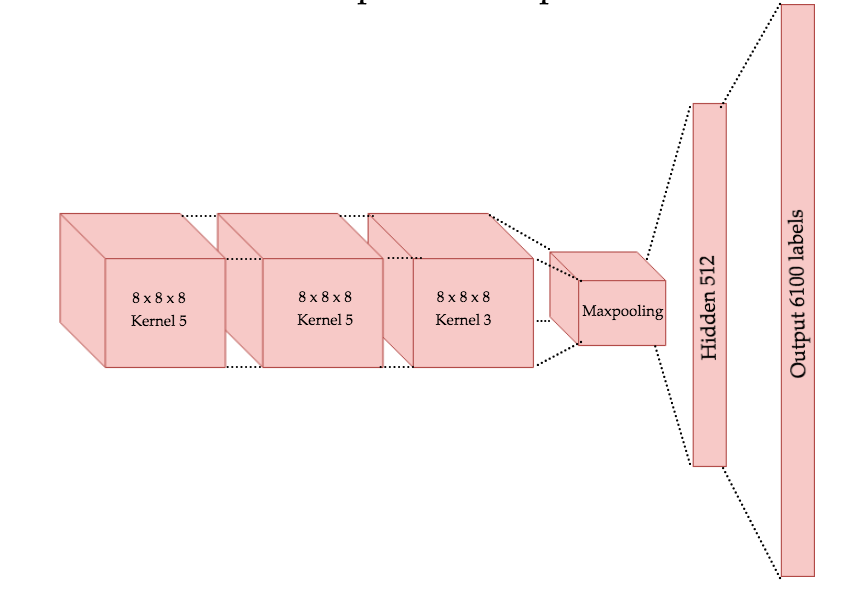

# A CNN Neural network to play chess

The neural network I used in my JSDayES talk: how to build an AI to play chess in 40 minutes. You can see the slides of the talk here: https://slides.com/gruizdevilla/chess-ai-with-javascript

This model is used to play chess in this repo: https://github.com/gonzaloruizdevilla/JSChessAI

Before training, you'll have to unzip the files in the data_train folder and store the txt in that same folder.

The topology used is roughly represented like this:

